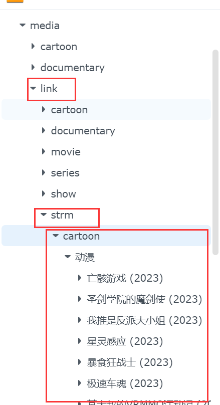
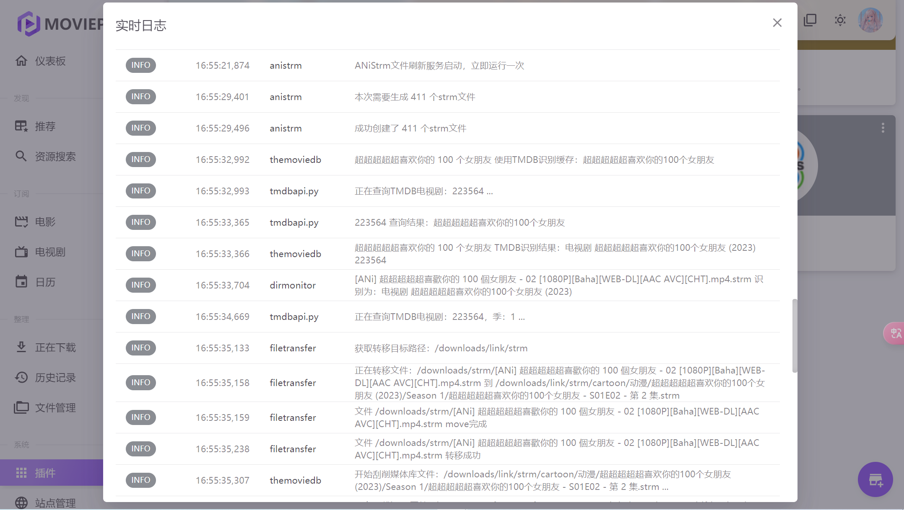

- [1. ANi-Strm插件](#MoviePilot-x-ANi-Strm)
    - [2023-10秋 刮削效果](#2023-10秋-刮削效果)
    - [注意事项](#注意事项)
    - [Todo](#Todo)
## 2023-10秋 刮削效果

<div align="center">
	
</div>


## MoviePilot x ANi-Strm

建议配合目录监控使用，strm文件创建在你插件填写的地址 如/downloads/strm

通过目录监控插件转移到link媒体库文件夹 如/downloads/link/strm，mp会完成刮削 这样也避免了污染正常视频文件的媒体库

```
/downloads/strm:/downloads/link/strm#copy
```

<div align="center">
	
</div>

不开启一次性创建全部，则每次运行会创建ani最新季度的top15个文件。

<div align="center">
	
</div>

> 非常感谢 https://aniopen.an-i.workers.dev TG:[Channel_ANi](https://t.me/channel_ani)

## 注意事项

**已解决**  ~~**已定位问题 疑似ffprobe命令读取网络视频的媒体信息时，给容器设定的代理，命令执行不生效**~~
> /bin/ffprobe -i "https://resources.ani.rip/2023-10/[ANi] 葬送的芙莉蓮 - 02 [1080P][Baha][WEB-DL][AAC AVC][CHT]
> .mp4?d=true" -threads 0 -v info -print_format json -show_streams -show_chapters -show_format -show_data

**emby容器代理设置**

❗ ❗ ❗ **环境变量必须多设置一条，键为小写的http_proxy的代理**

[ffprobe源码](https://github.com/FFmpeg/FFmpeg/blob/master/libavformat/http.c#L218C48-L218C48) 使用getenv_utf8("
http_proxy") 对大小写敏感。

emby docker-compose env

```yaml
- 'http_proxy=http://127.0.0.1:7890'
- 'HTTP_PROXY=http://127.0.0.1:7890'
- 'HTTPS_PROXY=http://127.0.0.1:7890'
```
另外clash 这两个域名记得设置代理规则
```
resources.ani.rip
aniopen.an-i.workers.dev
```

## Todo:

- [x] ~~网页、fileball 无法播放的问题，看看能不能解决，或者有无更好的源代替~~。
- [x] 更新获取最新方法，避免跨季度番剧漏抓
- [x] 排查是否存在bug，优化使用
