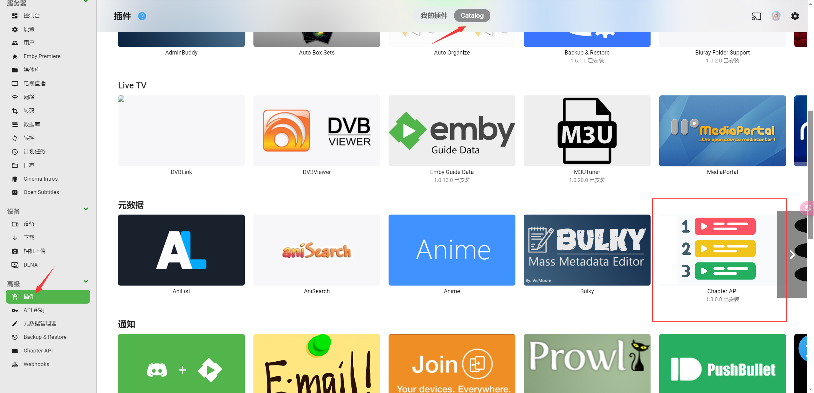
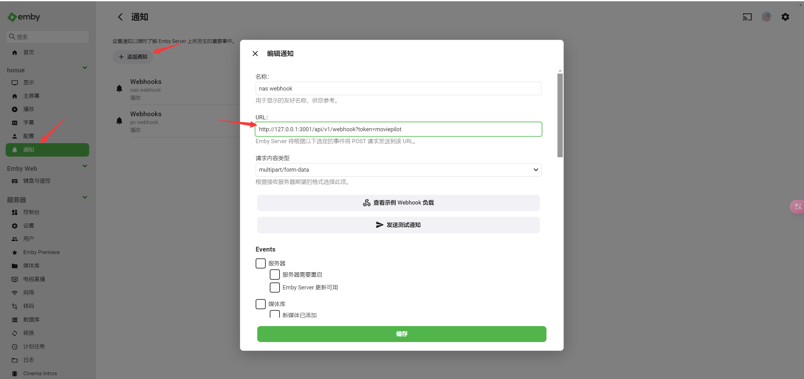
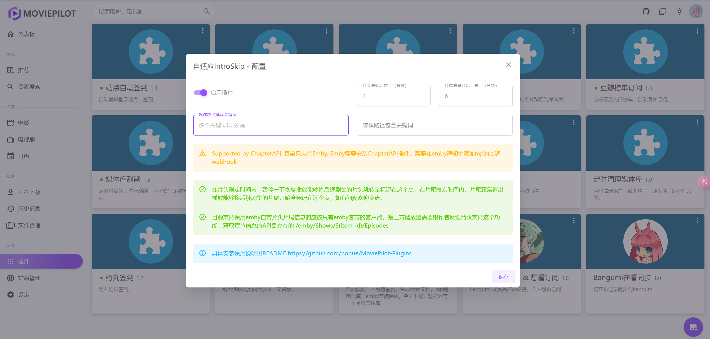

# AdaptiveIntroSkip的安装与使用
## Emby chapterAPI 插件安装
<div align="center">
	
</div>

> 高级-插件-catalog-元数据-chapterAPI

访问插件商店emby应该是需要挂代理的，安装好就行不用管这个插件了

## Emby通知 Webhook设置
<div align="center">
	
</div>

```
http://127.0.0.1:3001/api/v1/webhook?token=moviepilot
```

> 通知 webhook 自己视情况修改ip 端口是3001 是mp的后端端口不是前端的不要填3000去了，event事件，播放那四个记得勾上，截图没截上。

## MoviePilot 插件安装
<div align="center">
	
</div>

> 这里我就不多说了安装填写你要的排除关键词就行

## AdaptiveIntroSkip 使用

在片头限定时间内，暂停一下恢复播放能够将后续剧集的片头跳转全标记在这个点，在片尾限定时间内，片尾正常退出播放能够将后续剧集的片尾开始全标记在这个点。

具体的也会在log里输出，可以自行查看片头片尾标记的设置情况。 演示视频太大了，在这无法插入。

贴一个tg交流群中的消息链接，https://t.me/moviepilot_official/315892
